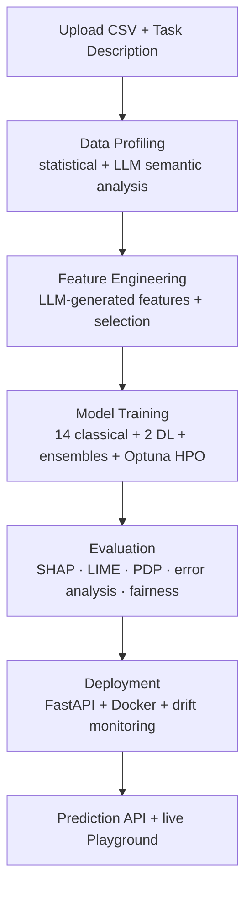

# FORGE

<!-- Replace OWNER/REPO with your GitHub path once pushed, e.g. saikiran/FORGE -->
[](https://github.com/OWNER/REPO/actions/workflows/ci.yml)


LLM-powered automated ML platform. Upload a dataset, describe your prediction goal, and FORGE automatically profiles data, engineers features, trains 14+ model architectures with Bayesian HPO, generates evaluation reports with explainability, and deploys the best model as a production API.

## Architecture



## Live Demo

<!-- Add your deployed URL once live -->
**Demo:** _add your Netlify URL_  ·  **Backend:** _add your API URL_

The app ships with a **pre-trained demo experiment** (`forge/api/demo/`) that the
API loads on startup, so the dashboard opens instantly with a real model
leaderboard, SHAP explanations, and reports — and the Playground makes live
predictions with **zero training required**. See [DEPLOYMENT.md](DEPLOYMENT.md).

To reseed the demo with your own dataset:

```bash
python scripts/build_demo_seed.py your_data.csv --target your_col --task "Predict ..."
# then commit the regenerated forge/api/demo/ directory
```

> The bundled seed uses an illustrative synthetic dataset (`forge/api/demo/demo_dataset.csv`).
> Swap in a real dataset (e.g. Titanic, Telco churn) before sharing the demo.

## Quick Start

```bash
# Install
pip install -e ".[dev]"

# Run pipeline (CLI)
forge run data.csv --target churn --task "Predict customer churn" --fast --trials 10

# Deploy trained model
forge deploy outputs/data --target churn --task "Predict customer churn"

# Start web app
forge serve api --port 8000          # Terminal 1
cd frontend && npm install && npm run dev  # Terminal 2
```

## Docker (Full Stack)

```bash
docker compose up --build
# API: http://localhost:8000
# UI:  http://localhost:3000
```

## Deployment

Frontend deploys to **Netlify** (static); the FastAPI backend runs on a
container host (Render/Railway/Fly.io). See **[DEPLOYMENT.md](DEPLOYMENT.md)**
for the step-by-step split-deploy guide.

## Deep Learning (optional)

The MLP and TabTransformer models require PyTorch, which is an optional extra
(kept out of the default install so the API image stays small):

```bash
pip install -e ".[deep-learning]"
```

Without it, deep-learning models are skipped automatically; all 14 classical
models, ensembles, and HPO run as normal.

## CLI Commands

| Command | Description |
|---------|-------------|
| `forge run` | Full ML pipeline on a dataset |
| `forge profile` | Profile dataset without training |
| `forge deploy` | Deploy trained model artifacts |
| `forge serve api` | Start FastAPI backend |

## API Endpoints

| Method | Path | Description |
|--------|------|-------------|
| POST | `/api/v1/experiments` | Upload dataset, start pipeline |
| GET | `/api/v1/experiments/{id}` | Get experiment status/results |
| POST | `/api/v1/experiments/{id}/deploy` | Deploy best model |
| POST | `/api/v1/experiments/{id}/predict` | Single prediction |
| GET | `/api/v1/experiments/{id}/model-info` | Deployed model input schema |
| GET | `/api/v1/experiments/{id}/monitoring` | Drift + performance metrics |
| GET | `/api/v1/experiments/{id}/report` | EDA or analysis report |

## Models

**Classical:** Logistic Regression, Ridge, Lasso, ElasticNet, SGD, Decision Tree, Random Forest, Extra Trees, XGBoost, LightGBM, CatBoost, KNN, SVM, Naive Bayes

**Deep Learning:** MLP, TabTransformer (PyTorch)

**Ensembles:** Voting, Stacking

## Optional: LLM Features

```bash
export OPENAI_API_KEY=sk-...
```

Without an API key, heuristic fallbacks are used for semantic profiling and feature engineering.

## Project Structure

```
forge/
├── profiling/          # Statistical + LLM semantic profilers, EDA reports
├── feature_engineering/ # LLM features, sandbox, selection
├── training/           # Classical + DL models, Optuna HPO
├── evaluation/         # Metrics, SHAP, LIME, error analysis, fairness
├── deployment/         # Model export, API generation, model cards
├── monitoring/         # Drift detection, performance tracking
└── api/                # FastAPI backend
frontend/               # React dashboard
benchmarks/             # Benchmark runner
tests/                  # Unit + integration tests
```

## Development

```bash
pytest tests/ -v
python benchmarks/run_all_benchmarks.py
```

## License

MIT
